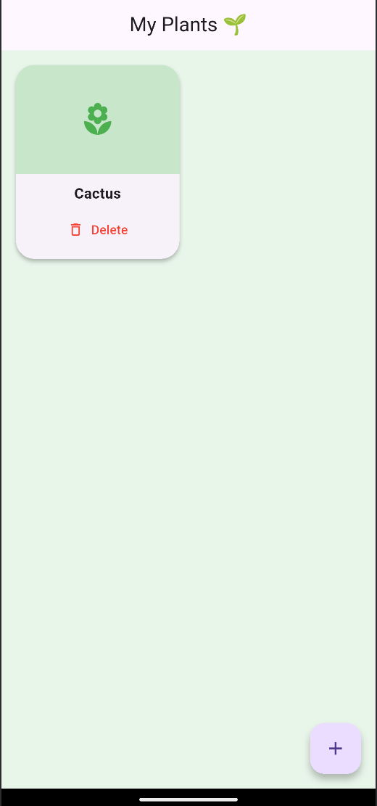
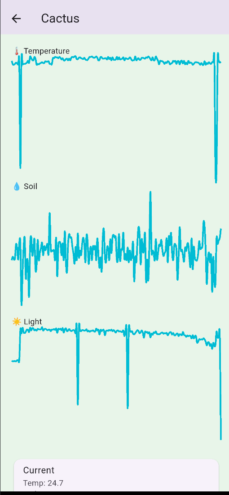
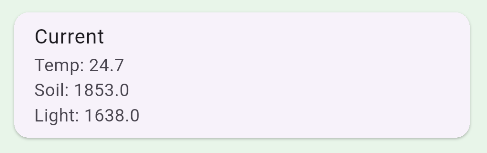
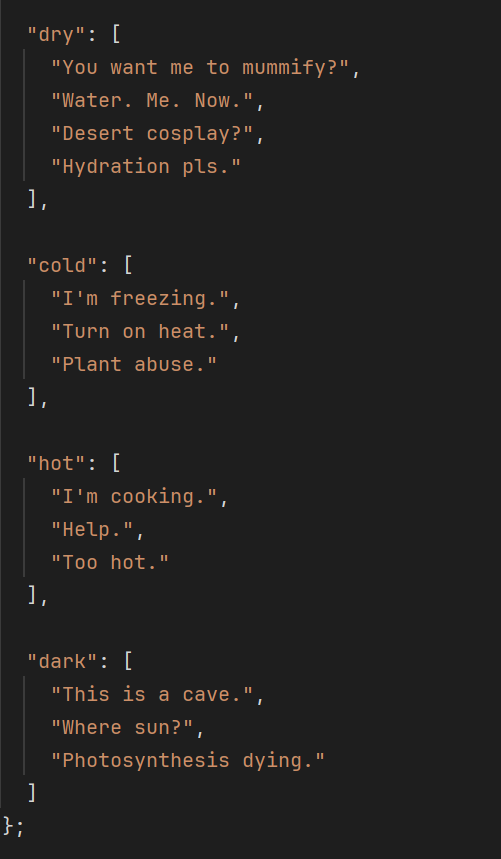

# PlantBullys

A system for Plants with Abandonment Issues!

Do you have a plant and you struggle with taking care of it? Do you forget to water or don't know when to do so?

Our system helps you out by reminding you in a very direct way: Bullying!

## How?

Our System works by monitoring multiple factors your plant would be affected by such as:

- Soil moisture
- Available Light
- Humidity
- Temperature

We monitor these using:

- DHT11 (Humidity and Temperature sensor)
- Photo-resistor
- Capacitive Soil Moisture sensor

All of this would go through an ESP32-WROOM-32D and sent via MQTT protocols (Topic and Subscribe) to a Database (SQLite).
These sensor values would be compared with data from a public Plant API (Perenual) to determine if these values are too high or too low.

A Dashboard in the form of a Flutter App would show your Plant, its current values, the ideal values, and what should be done right now.

If the values are irregular, and notification would be sent to you in the voice of the plant bullying you to do better.
They might be a bit harsh but they mean well, they just don't want to be abandoned and don't want to die :(

## Poster & Screenshots

